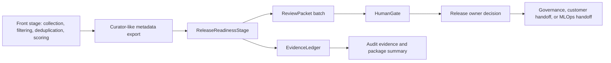
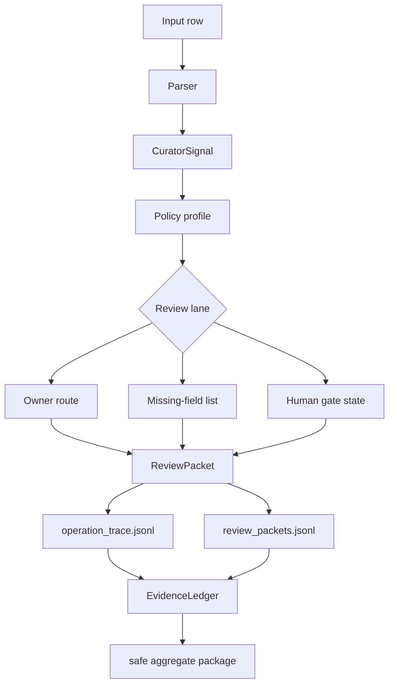
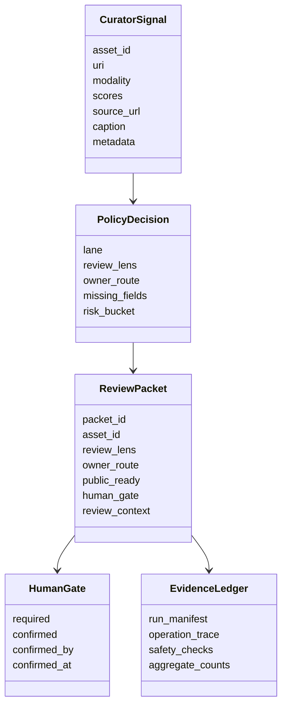
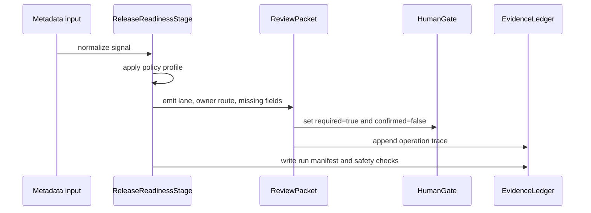
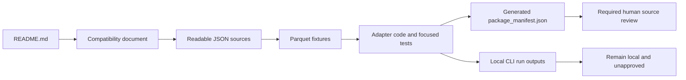

# VULCA Release-Readiness Stage

VULCA is a workflow-native release-readiness stage for Curator-like metadata.

It turns high-throughput curation outputs into source-aware, owner-routed, human-gated `ReviewPacket` and `EvidenceLedger` objects for enterprise release workflows.

```text
Curator-like metadata -> ReleaseReadinessStage -> ReviewPacket -> HumanGate -> EvidenceLedger
```

## At A Glance

| Area | What This Repo Shows | Reader Takeaway |
| --- | --- | --- |
| Workflow fit | A downstream stage after metadata export or write | VULCA is a handoff stage, not a replacement for curation or acceleration |
| Data object | `ReviewPacket` plus `EvidenceLedger` | Release review becomes structured and traceable |
| Policy surface | Review lanes, owner routes, missing fields, human gate | Enterprise release checks can be routed before public or operational use |
| Evidence | Source fixtures, focused tests, package manifest, and locally generated run evidence | A reviewer can compare shipped inputs with generated outputs |
| Candidate fixtures | 2-row source-first Parquet fixture, 2-row documented-enriched Parquet fixture, and 4-row JSONL sample | Every candidate data claim is inspectable and reproducible from shipped files |

## Why This Exists

High-throughput curation can produce useful metadata, scores, filters, captions, source fields, and export batches. Enterprise release workflows still need a second set of objects before those outputs are used in public, customer, brand, or operational contexts:

- source context and source-dependency status
- generated-media label posture
- rights, person, brand, and sensitive-content routing
- owner assignment and missing-field evidence
- a human gate that keeps `public_ready=false` until confirmation

VULCA does not replace curation, filtering, deduplication, acceleration, or model training. It adds a structured release handoff after curation output has already been produced.

## Architecture

The repository is built around one stable contract:

1. Parse upstream-style metadata into a normalized `CuratorSignal`.
2. Apply a policy profile to route each signal into release-readiness lanes.
3. Emit `ReviewPacket` objects for row-level handoff.
4. Emit `EvidenceLedger` objects for run-level traceability.
5. Build an allowlisted source candidate and local audit outputs without approving publication.

## Workflow Placement



| Workflow Area | VULCA Role | Out Of Scope |
| --- | --- | --- |
| Front stage | Reads already-produced metadata and source fields | Data collection, GPU decoding, deduplication, training |
| Mid stage | Normalizes metadata into policy-ready signals | Model scoring, retrieval, embedding generation |
| Back stage | Routes release checks, owner paths, and human gates | Legal certification or automatic approval |
| External handoff | Shows aggregate evidence and redacted examples | Raw sensitive rows or private source files |

## Stage Internals



The stage is intentionally small. The important behavior is not a UI table or an aesthetic score. It is the conversion of high-volume metadata into repeatable release decisions.

## Object Model



## Evidence Ledger



| Layer | What It Shows | Why It Matters |
| --- | --- | --- |
| `run_manifest.json` | parser, profile, counts, outputs, safety boundary | A reviewer can identify exactly what run produced the package |
| `operation_trace.jsonl` | input row to signal to lane to packet id | Row-level decisions are inspectable without relying on a screenshot |
| `review_packets.jsonl` | owner route, review lens, missing fields, human gate | Release review has a stable object that can move between systems |
| `safety_checks.json` | path leakage, public-ready state, unsafe HTML markers | External package generation is gated before sharing |
| `package_manifest.json` | included files and excluded surfaces | Recipient materials stay separated from local engineering artifacts |

## Policy Lanes

| Review Lane | Trigger | Owner Route | Output |
| --- | --- | --- | --- |
| `needs_generated_media_label_review` | generated-media label required or unclear | release owner | packet with label gate and `public_ready=false` |
| `needs_source_context` | source URL, source context, or provenance missing | source owner | packet with missing source fields |
| `needs_source_dependency_review` | source dependency required before reuse | source owner | packet with source-dependency decision basis |
| `needs_metadata_only_review` | no image or source asset is available | metadata reviewer | packet marked for metadata-only review |
| `needs_brand_owner_review` | brand, product, or release-owner hint present | brand or release owner | owner-routed review packet |
| `needs_sensitive_or_person_rights_review` | person, likeness, celebrity, or sensitive context risk | rights or legal reviewer | blocked release gate until review |
| `needs_artwork_rights_review` | artwork or rights attribution risk | rights reviewer | source-attribution review packet |
| `malformed_metadata_review_required` | required fields missing or malformed | data owner | packet plus missing-field trace |
| `visual_evidence_review_required` | visual evidence exists but needs release review | release owner | packet with visual evidence context |
| `human_release_gate_required` | policy says a human must confirm | release owner | `human_gate.required=true`, `confirmed=false` |

## What It Produces

- `ReviewPacket`: one asset or metadata row mapped to a review lane, owner route, missing fields, source context, and human gate state.
- `EvidenceLedger`: run-level evidence that explains what was checked, what lanes were triggered, and which safety boundaries were enforced.
- `run_manifest.json`: parser, profile, counts, outputs, and safety boundary for a run.
- `operation_trace.jsonl`: row-level trace from input metadata to normalized signal, triage decision, packet id, owner route, and gate state.
- `safety_checks.json`: leakage and release-boundary checks for generated artifacts.

## Operation Trace Shape

A local CLI run records each small, repeatable event:

```text
source_contract_row
  asset_id: demo_asset_042
  modality: image_metadata
  source_context: missing
  generated_media_label: required
  owner_hint: brand_release

stage_event
  stage: release_readiness
  operation: normalize_signal
  missing_fields: source_url, release_owner
  output_object: ReviewPacket

policy_hook_trace
  hook: generated_media_label
  lane: needs_generated_media_label_review
  owner_route: release_owner
  human_gate.required: true
  public_ready: false
```

## Quickstart

Python 3.11+ is required.

### JSONL compatibility example

The original JSONL workflow remains available as a separate compatibility path:

```bash
python3.11 -m pip install --upgrade pip
python3.11 -m pip install -e ".[dev]"
python3.11 -m pytest -q
python3.11 -m vulca_curator_adapter triage samples/nvidia_release_readiness_metadata.jsonl \
  --parser nemo \
  --profile creative-release \
  --out demo-output
```

The command writes local review artifacts to `demo-output`. Keep generated artifacts out of a public package unless they have been explicitly sanitized.

## ImageWriterStage Parquet quickstart

Install the optional Parquet dependency and triage the source-first fixture:

```bash
python3.11 -m pip install -e ".[nemo-parquet]"
python3.11 -m vulca_curator_adapter triage samples/nemo_image_writer_source_first.parquet \
  --parser nemo \
  --profile creative-release \
  --out demo-output
```

The fixture is generated locally from readable JSON, and this quickstart does not execute NeMo Curator. It covers only the five-column writer source contract pinned at commit `15cc645cbf9e9314fed9e11fc89f6535ea9a8820`, identified in VULCA as `nemo.image_writer.parquet.source-first.v1`. Optional aesthetic and NSFW scores appear only in the separate enriched fixture.

Key local artifacts include:

- `run_manifest.json`
- `operation_trace.jsonl`
- `review_packets.jsonl`
- `safety_checks.json`

`demo-output` is local QA output and must not be shared or included in a public package until it has been explicitly sanitized. `safety_checks.json` records `external_ready=false` and the redaction boundary; it does not sanitize or approve the directory.

See [docs/nemo-image-writer-parquet-compatibility.md](docs/nemo-image-writer-parquet-compatibility.md) for the pinned sources, observed documentation difference, reproduction steps, and claim boundary.

## Example Input

The public sample fixture is synthetic metadata. It is shaped like a curation export, not a private customer dataset.

```json
{
  "asset_id": "demo_asset_042",
  "uri": "sample://demo_asset_042",
  "modality": "image",
  "caption": "Generated product visual with brand placement",
  "source_url": "",
  "scores": {
    "aesthetic": 0.81,
    "safety": 0.97
  },
  "metadata": {
    "generated_media_label": "required",
    "owner_hint": "brand_release",
    "source_context": "missing"
  }
}
```

## Example ReviewPacket

```json
{
  "packet_id": "review-demo_asset_042",
  "asset_id": "demo_asset_042",
  "review_lens": "generated_media_label",
  "owner_route": "release_owner",
  "missing_fields": ["source_url", "release_owner"],
  "public_ready": false,
  "human_gate": {
    "required": true,
    "confirmed": false
  }
}
```

## Evidence Coverage

The focused candidate uses only shipped, public-safe synthetic fixtures and tests. Each row count below can be checked directly against its readable source and generated Parquet fixture.

| Evidence Source | Inspectable Fact | Candidate Files |
| --- | --- | --- |
| Source-first ImageWriter fixture | 2-row source-first Parquet fixture | `samples/nemo_image_writer_source_first.source.json` and `samples/nemo_image_writer_source_first.parquet` |
| Documented-enriched ImageWriter fixture | 2-row documented-enriched Parquet fixture | `samples/nemo_image_writer_documented_enriched.source.json` and `samples/nemo_image_writer_documented_enriched.parquet` |
| Release-readiness compatibility sample | 4-row JSONL sample | `samples/nvidia_release_readiness_metadata.jsonl` |
| Mapper, reader, and fixture coverage | focused mapper, reader, and fixture tests | `tests/test_nemo_image_writer.py`, `tests/test_nemo_parquet.py`, and `tests/test_nemo_parquet_fixtures.py` |
| Local CLI evidence | manifests, operation traces, review packets, and safety outputs generated per run | inspect locally after running the quickstart; these outputs are not shipped in the source candidate |

These fixtures are contract evidence, not a throughput benchmark or a claim about generic NeMo or Cosmos export support.

## Package Surfaces



| Candidate Surface | Review Purpose | Shipped Content |
| --- | --- | --- |
| Root `README.md` | understand architecture, quickstarts, and boundaries | this review guide |
| `docs/nemo-image-writer-parquet-compatibility.md` | verify pinned upstream sources and claim limits | compatibility evidence |
| readable sources and Parquet fixtures | compare source rows with binary fixture rows | `samples/nemo_image_writer_source_first.source.json`, `samples/nemo_image_writer_source_first.parquet`, `samples/nemo_image_writer_documented_enriched.source.json`, and `samples/nemo_image_writer_documented_enriched.parquet` |
| adapter code and focused tests | inspect mapping, reading, and fixture generation | `src/vulca_curator_adapter/`, `scripts/build_nemo_image_writer_parquet_fixtures.py`, and the three focused tests |
| `package_manifest.json` | verify the exact allowlisted candidate contents | generated manifest inside the candidate directory and zip |

Local generated run outputs are not included in the source candidate and remain unapproved.

## Review Path

Recommended review order:

1. Read this `README.md` to understand the workflow-native stage and boundaries.
2. Read `docs/nemo-image-writer-parquet-compatibility.md` to verify the pinned source contract and claim boundary.
3. Inspect `package_manifest.json` to confirm the exact allowlisted candidate contents.
4. Compare the readable JSON sources with both Parquet fixtures and the focused mapper, reader, and fixture tests.
5. Run the CLI locally and inspect `run_manifest.json`, `operation_trace.jsonl`, `safety_checks.json`, and `review_packets.jsonl`.

The generated run directory stays outside the source candidate. Its contents remain local QA evidence and do not confirm the required human gate.

The useful external conversation is not "does NVIDIA need a new review app?" The useful question is whether release-readiness is the right downstream integration surface for Curator/Cosmos-style workflows.

## Repository Layout

```text
src/vulca_curator_adapter        package code
scripts                          build and validation scripts
samples                          public-safe synthetic metadata fixtures
configs                          policy and pipeline configuration
docs                             pinned ImageWriter compatibility note
tests                            focused mapper, reader, and fixture tests
```

## Boundaries

- No NVIDIA affiliation or endorsement is implied.
- No replacement is claimed for NeMo Curator, Cosmos Curator, GPU acceleration, model training, or data-center workflow execution.
- No legal, rights, safety, or release certification is performed automatically.
- All review packets default to `public_ready=false`.
- Human confirmation is required before any release decision can be treated as final.
- Only allowlisted source files are copied into a candidate package; local run outputs stay outside it.

## Review Request

The useful review question is narrow:

```text
Is release-readiness the right downstream integration surface for Curator/Cosmos-style workflows, and who is the right technical or product owner to review this stage?
```
