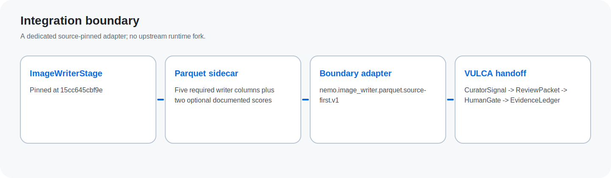
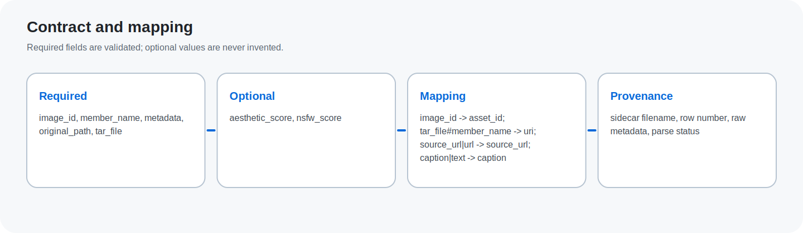
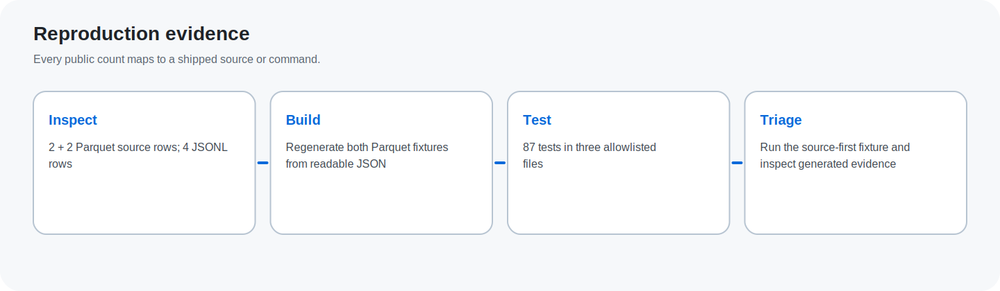

# NeMo Curator Parquet Boundary Adapter

Source-pinned local engineering evidence for the real `ImageWriterStage` Parquet writer boundary at `NVIDIA-NeMo/Curator@15cc645cbf9e9314fed9e11fc89f6535ea9a8820`.

> Review request: validate this narrow boundary and route the repository to the appropriate NeMo Curator maintainer for technical review. This is an engineering handoff, not a recruiting request.

## Verified evidence

- 87 public tests
- 2 source-first rows
- 2 documented-enriched rows
- 4 JSONL compatibility rows
- Adapter contract: `nemo.image_writer.parquet.source-first.v1`

## Why this boundary

The adapter reads one metadata sidecar, validates the pinned writer schema, preserves sidecar and row provenance, and reuses VULCA's existing `CuratorSignal`, `ReviewPacket`, `HumanGate`, and `EvidenceLedger` path. It does not fork or replace NeMo Curator.

Repository: https://github.com/vulca-org/vulca-nemo-curator-adapter

<!-- PAGE BREAK -->

# Evidence and limits

## Reproduce

1. Install with `python3.11 -m pip install -e '.[nemo-parquet,dev]'`.
2. Build both Parquet fixtures from their readable JSON sources.
3. Run the three allowlisted test files and verify 87 passing tests.
4. Triage the source-first fixture and inspect the manifest, trace, safety checks, and review packets.

## Claim boundary

- Synthetic public-safe fixtures only.
- No full NeMo Curator, CUDA, DALI, Ray, Xenna, GPU, multi-shard, or tar-member execution claim.
- No generic NeMo or Cosmos compatibility claim.
- No NVIDIA endorsement or upstream integration is claimed.

## Maintainer review questions

1. Is the pinned five-column writer boundary represented accurately?
2. Is optional documented-score handling an appropriate forward-compatible boundary?
3. Which NeMo Curator owner or contribution surface should evaluate this adapter next?
